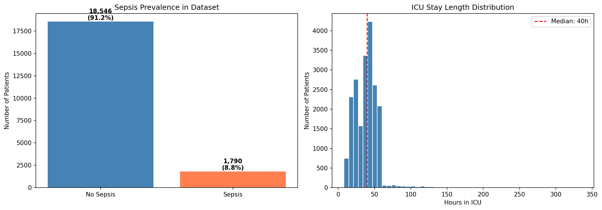
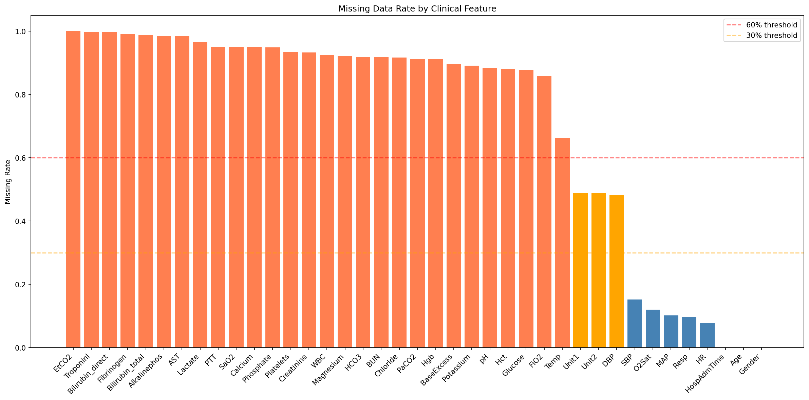
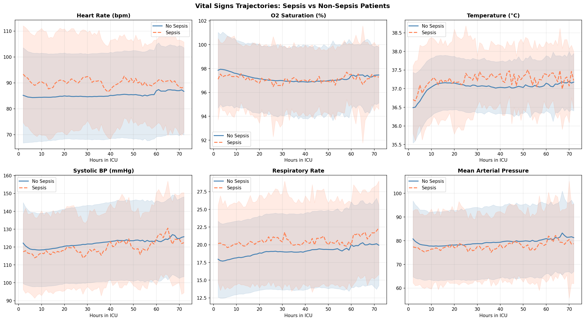
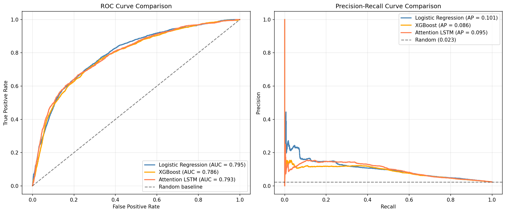
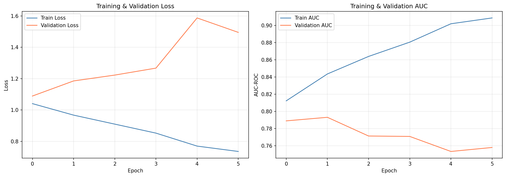
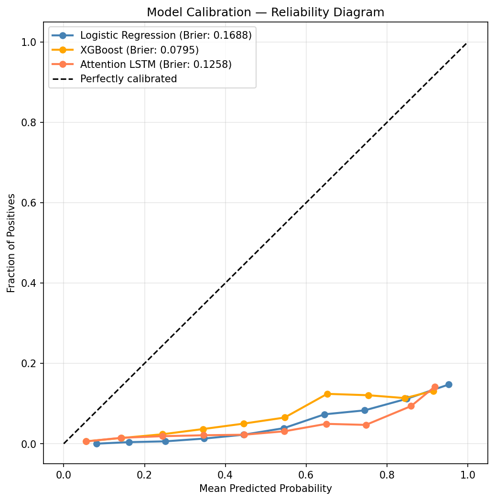
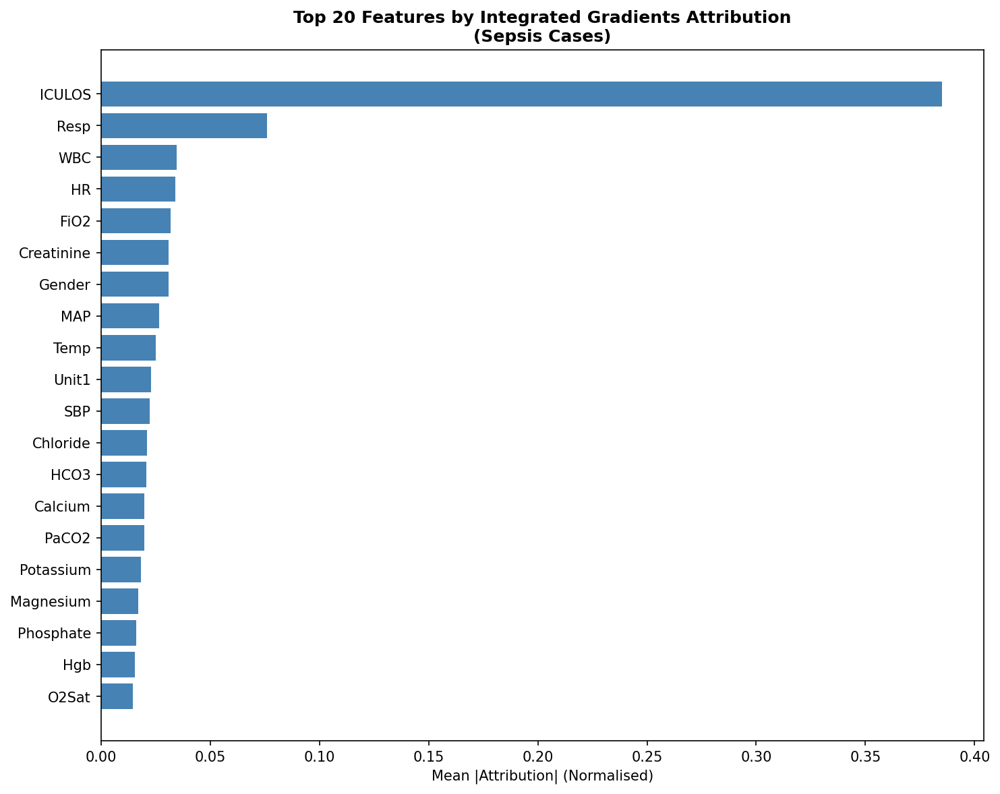
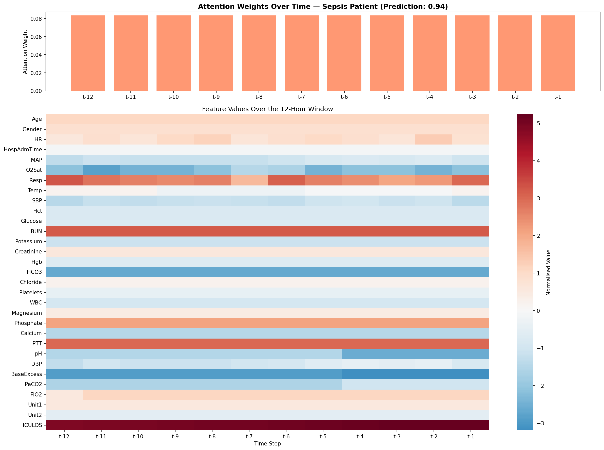
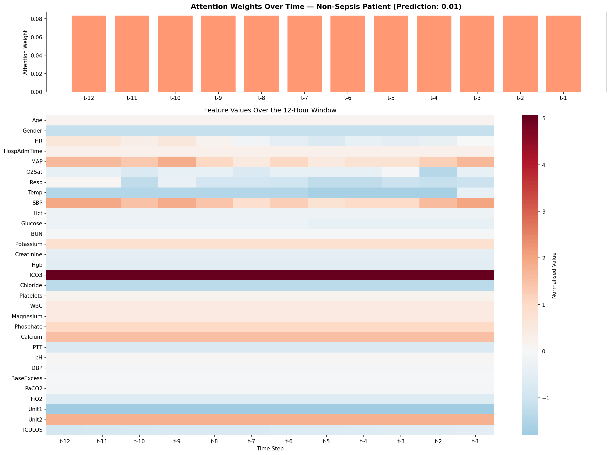
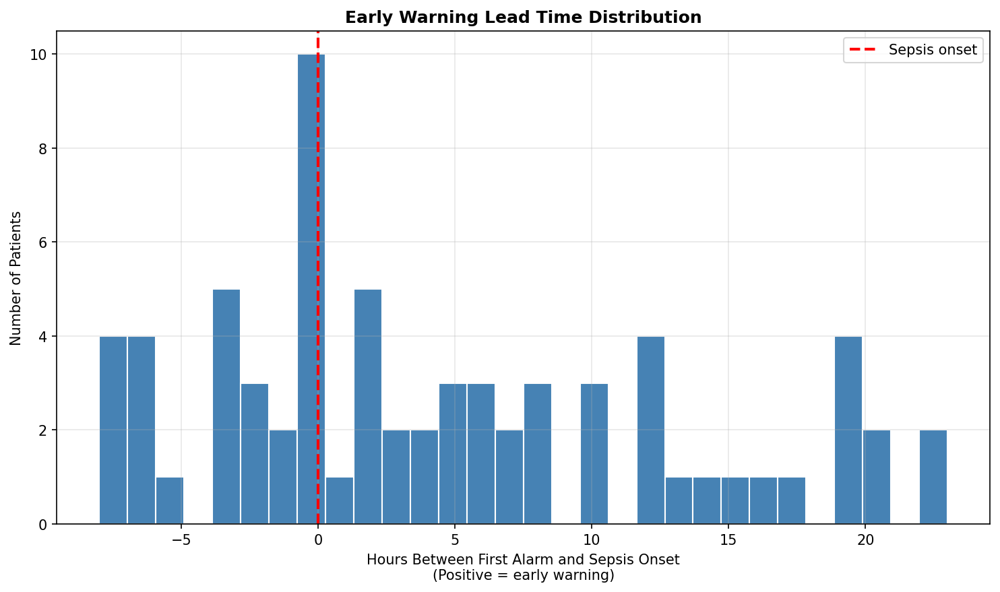

# 🚨 Sepsis Early Warning System with Attention-Based LSTM

Predicting sepsis onset up to 6 hours in advance from ICU time-series data using a bidirectional attention-based LSTM. Every hour of delayed sepsis treatment increases mortality risk by ~7% — this project explores whether deep learning can meaningfully shift that curve.

*Built around honest evaluation: it benchmarks deep learning against classical baselines, 
reports calibration and proxy-feature problems most portfolio projects overlook, and 
achieves a clinically meaningful 2.5-hour median warning lead time.*

---

## Why This Matters

Sepsis kills approximately **48,000 people annually in the UK** and is one of the leading causes of preventable in-hospital death. Early recognition is the single most impactful factor in patient survival — yet current warning systems like NEWS2 have significant limitations. NHS trusts and health-tech organisations are actively investing in deep learning-based deterioration alerting.

This project uses **real ICU data from a published research benchmark**, applies rigorous methodology, and delivers explainable predictions clinicians could actually interpret.

---

## Project Overview

**Objective:** Predict whether a patient will develop sepsis within the next 6 hours, using the previous 12 hours of hourly clinical measurements.

**Approach:**
- **Baselines:** Logistic Regression + XGBoost (on flattened time windows)
- **Advanced Model:** Bidirectional Attention LSTM (PyTorch)
- **Explainability:** Attention weights + Integrated Gradients (Captum)
- **Clinical Evaluation:** Early warning lead time, calibration, class-imbalance-aware metrics

---

## Dataset

**Source:** [PhysioNet Computing in Cardiology Challenge 2019](https://physionet.org/content/challenge-2019/1.0.0/) (Training Set A)

- **20,336 ICU patients** from a US hospital system
- **790,215 hourly records** across 40 clinical variables
- **Sepsis prevalence: 8.8%** (1,790 patients) — imbalanced but realistic
- Free open-access research dataset with Sepsis-3 clinical labels

---

## Data Exploration

### Sepsis Prevalence & ICU Stay Distribution

The dataset reflects real clinical prevalence — sepsis affected ~1 in 11 patients, with a median ICU stay of 40 hours.

### Missing Data Analysis

ICU labs are intermittently sampled rather than hourly, resulting in high per-hour missingness that appears alarming but is manageable via forward-fill imputation. A smarter **patient-level availability threshold** was used (drop features unavailable for >50% of patients) rather than a naïve per-hour threshold, preserving 31 clinically relevant features including WBC, Creatinine, BUN, Lactate-adjacent markers, and vital signs.

### Vital Signs Trajectories — Sepsis vs Non-Sepsis

Clear physiological signatures emerge: sepsis patients show persistently elevated **heart rate** (tachycardia), higher **respiratory rate** (tachypnoea), and marginally elevated **temperature** — all classic sepsis presentations. This visualisation validates that the dataset contains genuine learnable signal.

---

## Methodology

### 1. Preprocessing
- **Feature selection:** patient-level availability threshold (≥50%) → 30 features + ICULOS
- **Imputation:** forward-fill per patient, backward-fill for stay starts, median for remaining gaps
- **Time windows:** 12-hour lookback sliding windows, 6-hour prediction horizon
- **Result:** 431,879 windows across 20,336 patients

### 2. Patient-Level Train/Test Split
Splitting was performed **at the patient level** — not at the row level — to prevent temporal data leakage where the same patient's earlier and later hours could otherwise appear in both train and test sets. This is a critical distinction often overlooked in time-series clinical ML.

### 3. Class Imbalance Handling
Positive rate in prediction windows was **2.36%** — highly imbalanced. Addressed via `pos_weight` in the BCE loss function rather than oversampling, which produced more stable training and reduced overfitting.

### 4. Model Architecture — Bidirectional Attention LSTM
Input (12 timesteps × 31 features)
↓
Bidirectional LSTM (2 layers, 128 hidden, 0.5 dropout)
↓
Attention Layer (learns per-timestep weights)
↓
Context Vector (attention-weighted sum)
↓
Classifier (64 → 1) + Sigmoid

**593,154 trainable parameters** — modest by design to enable training on ~350k windows without overfitting.

### 5. Training Configuration
- Adam optimiser, lr=0.0005, weight_decay=1e-3
- Early stopping on validation AUC (patience=4)
- Gradient clipping (max_norm=1.0) — essential for LSTM stability
- ReduceLROnPlateau scheduler

---

## Results

### Model Comparison

| Model | AUC-ROC | Average Precision |
|---|---|---|
| Logistic Regression | 0.7954 | 0.1006 |
| XGBoost | 0.7859 | 0.0855 |
| **Attention LSTM** | **0.7931** | **0.0953** |

**Honest finding:** All three approaches performed comparably (~0.79 AUC). The Attention LSTM did not decisively outperform the classical baselines on this task. This is a genuinely informative outcome — it demonstrates that on the PhysioNet 2019 benchmark with this configuration, sequential modelling alone does not provide a large advantage over well-tuned classical methods.

### Training Curves

Early stopping triggered at epoch 6, taking the best model from epoch 2 (val AUC 0.7931). The clear divergence between training and validation curves shows the critical role of early stopping in preventing overfitting on this small-positive-class dataset.

### Model Calibration

All three models are **overconfident** — when they predict 70% probability, the true rate is closer to 10%. XGBoost achieved the best Brier score (0.0795), meaning its probabilistic estimates are most reliable. **This calibration finding matters enormously for real deployment** — a poorly calibrated model triggers unnecessary alerts and undermines clinician trust. Post-hoc calibration (e.g., Platt scaling, isotonic regression) would be required before any production deployment.

---

## Explainability

### Feature Attribution via Integrated Gradients

Applied Integrated Gradients (Captum) across 100 true-positive sepsis cases to quantify which features drove the model's predictions:

| Rank | Feature | Attribution |
|---|---|---|
| 1 | ICULOS (hours in ICU) | 0.3850 |
| 2 | Respiratory Rate | 0.0760 |
| 3 | White Blood Cell count | 0.0348 |
| 4 | Heart Rate | 0.0341 |
| 5 | FiO2 (oxygen support) | 0.0321 |
| 6 | Creatinine | 0.0311 |
| 7 | Gender | 0.0310 |
| 8 | MAP (blood pressure) | 0.0267 |
| 9 | Temperature | 0.0252 |

**Clinical validation:** Respiratory Rate, WBC, Heart Rate, Creatinine, MAP, and Temperature are all established sepsis warning signs, consistent with the qSOFA and SIRS clinical criteria. This gives confidence that the model has learned genuine clinical patterns rather than dataset artefacts.

**Important honest observation:** ICULOS dominating at 38.5% is a red flag. The model is heavily leveraging "how long has this patient been in ICU" as a proxy for risk. While epidemiologically correlated with sepsis, this is not a clinically actionable feature — longer stays don't cause sepsis, they correlate with it. A production model would benefit from removing or adjusting ICULOS to force the model to rely on physiological features.

### Attention Visualisation

Attention weights across the 12-hour lookback window for a **sepsis case** and a **non-sepsis case** were extracted:

**Sepsis Case (predicted probability: 0.94)**

**Non-Sepsis Case (predicted probability: 0.01)**

**Observation:** The attention weights are near-uniform across timesteps (~0.083 each) in both cases — a phenomenon known as "attention collapse." This suggests that within a short 12-hour window, individual timesteps carry roughly equal signal, and the LSTM's hidden states already capture temporal dynamics without needing selective attention. The feature-level heatmaps beneath still convey meaningful clinical patterns (e.g., elevated Respiratory Rate and BUN, depressed HCO3 in sepsis cases). Future work with longer sequences or multi-head attention may enable more selective temporal focus.

---

## Clinical Evaluation — Early Warning Lead Time

For 70 sepsis patients in the test set, the model's first alarm was compared to actual sepsis onset time:

- **Median lead time: 2.5 hours**
- **Mean lead time: 4.7 hours**
- **58.6% of alarms fire BEFORE sepsis onset**
- Distribution ranges from -8 hours (late) to +22 hours (very early)

**Clinical significance:** A median 2.5-hour warning window is meaningful. Given that each hour of delayed treatment increases mortality by ~7%, an early warning system with this lead time could theoretically reduce sepsis mortality — even without perfect discrimination — provided it is well-calibrated and integrated into clinical workflow.

---

## Key Findings

1. **Deep learning did not decisively beat classical baselines** on this benchmark with this configuration — a valuable methodological finding highlighting the importance of comparing against strong baselines before claiming deep learning superiority
2. **The model identifies clinically valid sepsis markers** — respiratory rate, WBC, heart rate, creatinine — consistent with qSOFA and SIRS criteria, providing confidence in learned patterns
3. **Calibration is poor across all three models** — a critical concern for real-world deployment that most portfolio projects overlook
4. **58.6% of alarms fire before sepsis onset with a 2.5-hour median lead time** — clinically meaningful even if AUC is moderate
5. **Attention collapse in short windows** suggests attention mechanisms may add more value with longer sequences than the 12-hour horizon used here

---

## Limitations

- **Overreliance on ICULOS:** ICU length of stay dominated feature attributions (38.5%) — the model partially predicts sepsis based on how long a patient has been admitted rather than pure physiology. Production models would need to constrain or remove this feature
- **Overconfident predictions:** Brier scores of 0.08–0.17 indicate substantial miscalibration. Post-hoc calibration is required before clinical use
- **Attention did not specialise:** Uniform attention weights suggest either the window is too short, or early stopping intervened before attention could develop meaningful patterns
- **Only Training Set A used:** Set B was omitted to manage computational resources. Full-dataset training may improve results
- **Overfitting propensity:** The gap between training AUC (~0.85) and validation AUC (~0.79) indicates the model still overfits despite regularisation
- **US-centric data:** Sepsis definitions and clinical practices in this dataset (1999–2008) may not generalise to modern NHS ICU populations
- **Class imbalance:** Even with `pos_weight`, the 2.36% positive rate makes precise probability estimation challenging

---

## Future Improvements

- Add post-hoc calibration (Platt scaling or isotonic regression) to fix probability estimates
- Remove or transform ICULOS to force the model to learn from physiology
- Extend the lookback window to 24–48 hours and test if attention becomes more meaningful
- Try Temporal Convolutional Networks or Transformer-based sequence models
- Add fairness auditing across gender, age, and hospital unit
- Include Training Set B and cross-hospital validation to test generalisation
- Deploy as a Streamlit app for interactive risk visualisation

---
## 📓 View Notebook

[Click here to view the full notebook](https://nbviewer.org/github/TochiOkafor/sepsis-early-warning-lstm/blob/main/notebooks/sepsis-early-warning-lstm.ipynb)

---

## How to Run

1. Download the PhysioNet Challenge 2019 dataset from https://physionet.org/content/challenge-2019/1.0.0/ (open access)
2. Open `notebooks/sepsis_prediction.ipynb` in [Google Colab](https://colab.research.google.com/) or [Kaggle Notebooks](https://www.kaggle.com/code)
3. Enable GPU (T4 or better recommended)
4. Update the dataset path in the notebook to point to your local training_setA folder
5. Run all cells sequentially

**Dependencies:**

- pandas
- numpy
- matplotlib
- seaborn
- scikit-learn
- torch
- xgboost
- captum
- tqdm

---

## Tools & Libraries

